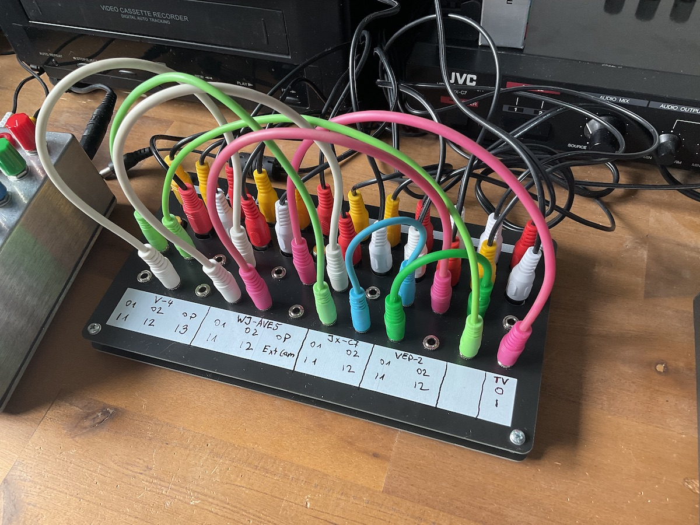

# VP Buddy

VP Buddy is a simple video patch bay for patching composite video sources to different destinations. Patching is done via mini jack. There is no normalization for the connections, so what you patch is what you get. It is a passive device, so no need for a power supply. It just connects input and output jacks together, nothing more.

## Yes, but why?

I make [video art](https://rauschfeld.com) with a bunch of old analog video devices, some of them circuit bent and they mainly use composite video with RCA jacks. I kept forgetting what was connected where and when I saw [a video by All My Friends Are Synths](https://www.youtube.com/watch?v=RH4UdIBQ26o) about a mini jack desktop patch bay that he used with RCA adapters to patch his video devices, I wanted to make a dedicated video patch bay without the need for adapters. Of course, VP Buddy isn't as fancy as the [DF Audio Minibay](https://www.dfaudio.com.au/home) that is shown in the video, but it does the job in helping my forgetful brain to see what is going on in my video patch.

## How to patch

Every top RCA jack is connected to the top mini jack in the corresponding column, every bottom RCA jack is connected the bottom mini jack in the corresponding column. Use this however you like. I have patched all outputs (source) of my devices to the top RCA rows and all inputs (destination) of my devices to the bottom RCA rows. You can use the white field at the bottom to indicate what is connected.

## Why mini jack?

Mini jack patch cables are readily available (at your favorite euro rack synthesizer shop, for example) and come in different lengths and colors. They are easier to handle than the often very long RCA cables.

## Building VP Buddy

### BOM

- [24 RCA jacks (CUI Devices RCJ-24)](https://www.mouser.com/ProductDetail/490-RCJ-024) (RCJ-21 to RCJ-27 will all work, they're just different colors. Mix and match however you like – RCJ-24 is the classic "video yellow".)
- [24 Thonkiconn jack sockets and 24 nuts](https://www.thonk.co.uk/shop/thonkiconn/)
- For more stability: standoff screws with a height of 10mm
- 4 rubber feet

### PCBs

- Get the gerber file zips for the bottom PCB and the top PCB.
-- [bottom PCB](https://github.com/sarweiler/jamloopy-ctrl/releases/latest/download/jamloopy-ctrl-gerbe
rs.zip)
-- [top PCB](https://github.com/sarweiler/jamloopy-ctrl/releases/latest/download/jamloopy-ctrl-gerbe
rs.zip)
- Upload the zipped files to a PCB manufacturer of your choice and order the PCBs. Default settings should be okay.

### Soldering

- In order to get the mini jack sockets aligned correcly with the top PCB insert the two left most and the two right most mini jacks first. Do not solder them yet. Put the top PCB on and secure the four jack sockets with nuts (not very tight, you will need to unscrew them again).
- Carefully turn your PCB sandwich over and solder the mini jack sockets.
- Unscrew the nuts, take the top PCB off, and and insert all other mini jack sockets. Carefully place the top PCB and put nuts on the four mini jacks that you soldered previously. Turn the PCB sandwich over and solder all mini jack sockets.
- Unscrew the nuts again and take off the top PCB.
- Place all RCA jacks, turn the PCB over (no need to attach the top PCB) and solder all RCA jacks.
- Snip off too long leads protruding at the bottom.
- Install the top PCB with the standoff screws.
- Install the nuts on all mini jacks.
- Install rubber feet, so nothing bad happens, when using VP Buddy on conductive surfaces.
- Done! Happy patching!

## Disclaimer

I'm not an electronics expert, just self taught. Build and use VP Buddy at your own risk.

## License

This work is licensed under [CC-BY-SA 4.0](http://creativecommons.org/licenses/by-sa/4.0/).

